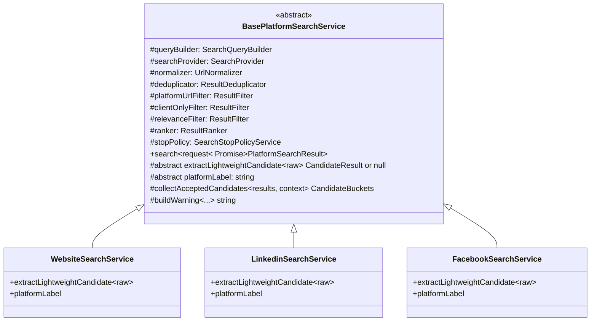
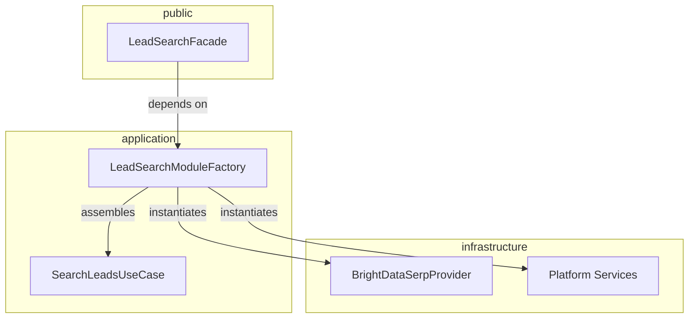

# Lead Search Module - Review & Fix Plan

## Summary of Findings

After a thorough review of the entire `lead-search` module, I identified **8 significant issues** ranging from architecture violations to massive code duplication. Below is the detailed analysis and fix plan for each.

---

## Issue 1: Massive Code Duplication Across 7 Platform Services 🔴 CRITICAL

**Files affected:**
- [`website-search.service.ts`](src/modules/lead-search/infrastructure/platform-services/website-search.service.ts)
- [`linkedin-search.service.ts`](src/modules/lead-search/infrastructure/platform-services/linkedin-search.service.ts)
- [`facebook-search.service.ts`](src/modules/lead-search/infrastructure/platform-services/facebook-search.service.ts)
- [`instagram-search.service.ts`](src/modules/lead-search/infrastructure/platform-services/instagram-search.service.ts)
- [`x-search.service.ts`](src/modules/lead-search/infrastructure/platform-services/x-search.service.ts)
- [`tiktok-search.service.ts`](src/modules/lead-search/infrastructure/platform-services/tiktok-search.service.ts)
- [`snapchat-search.service.ts`](src/modules/lead-search/infrastructure/platform-services/snapchat-search.service.ts)

**Problem:** All 7 platform services contain nearly identical ~300+ line implementations. The `search()` method, the pool management logic, the stop-policy integration, the `collectAcceptedCandidates()` method, and the `buildWarning()` method are copy-pasted across all files. The only differences are:
- The `SearchPlatform` enum value used
- The `extractLightweightCandidate()` method which varies slightly per platform
- Minor wording differences in warning messages

This means ~250 lines are duplicated 7 times = ~1,750 lines of redundant code.

**Fix:** Extract a `BasePlatformSearchService` abstract class that contains the entire search loop, pool management, candidate collection, and warning building. Each platform service extends it and only provides:
- The `platform` enum value
- The `extractLightweightCandidate()` override
- Platform-specific warning wording if needed



---

## Issue 2: Architecture Violation - Facade Depends on Infrastructure 🔴 CRITICAL

**File affected:** [`lead-search.facade.ts`](src/modules/lead-search/public/lead-search.facade.ts)

**Problem:** The `LeadSearchFacade` in the `public/` layer directly imports and instantiates **15+ infrastructure classes**:
- `BrightDataSerpProvider`, `DefaultUrlNormalizer`, `DefaultResultDeduplicator`
- `PlatformUrlFilter`, `ClientOnlyResultFilter`, `RelevanceResultFilter`
- `DefaultRelevanceRanker`
- All 7 platform services and all 7 query builders
- `MySQLAuditLogRepository` from the auth module

This violates the architecture defined in [`ARCHITECTURE.md`](src/modules/lead-search/ARCHITECTURE.md) which states:
> `public` -> depends on -> `application` and `domain` only
> **PROHIBITED**: `public` depends on `infrastructure` directly

**Fix:** Create a `LeadSearchModuleFactory` in the `application/` layer that assembles all dependencies. The facade receives the factory or the assembled use-case, keeping `public/` clean of infrastructure imports.



---

## Issue 3: QueryExpansionService is Dead Code 🟡 HIGH

**Files affected:**
- [`query-expansion.service.ts`](src/modules/lead-search/application/services/query-expansion.service.ts)
- [`base-query-expansion.dictionary.ts`](src/modules/lead-search/infrastructure/query-builders/base-query-expansion.dictionary.ts)

**Problem:** The `QueryExpansionService` and its `BASE_QUERY_DICTIONARY` are never used in the search pipeline. The query builders use `QueryPatternBuilderService.prepare()` which generates search patterns but does NOT leverage the bilingual dictionary expansion. This means:
- Keywords like "عقارات" never get expanded to "Real Estate" or "Property"
- The entire dictionary with 11 concept categories is wasted
- Search quality suffers because cross-language variants are never searched

**Fix:** Wire `QueryExpansionService` into `QueryPatternBuilderService` so that expanded variants are included in the generated patterns. The `prepare()` method should accept expanded variants and generate patterns for each variant, not just the original keyword.

---

## Issue 4: Platform Services Do Not Implement Domain Interface 🟡 MEDIUM

**File affected:** All 7 platform services + [`repositories.ts`](src/modules/lead-search/domain/repositories.ts:112)

**Problem:** The domain defines `PlatformSearchService` interface:
```typescript
export interface PlatformSearchService {
  search(request: SearchRequest): Promise<PlatformSearchResult>;
}
```
But none of the 7 platform service classes explicitly `implements PlatformSearchService`. They have the matching method signature but don't formally implement the interface, weakening type safety.

**Fix:** Add `implements PlatformSearchService` to the base class after Issue 1 is resolved.

---

## Issue 5: extractLocation Only Covers 7 of 18 Cities 🟡 MEDIUM

**File affected:** All 7 platform services - e.g., [`website-search.service.ts:283-296`](src/modules/lead-search/infrastructure/platform-services/website-search.service.ts:283)

**Problem:** The `extractLocation()` method only checks for 7 city patterns:
```
riyadh, jeddah, dammam, khobar, makkah, madinah, saudi arabia, ksa
```
But the `SupportedSaudiCity` enum defines **18 cities**. Missing:
- Taif, Tabuk, Abha, Khamis Mushait, Buraidah, Hail, Jazan, Najran, Al Ahsa, Yanbu, Jubail, Dhahran

**Fix:** Create a shared `CityExtractionUtility` that covers all 18 cities from the enum, and use it in the base class.

---

## Issue 6: No Domain-Specific Error Types 🟢 LOW

**File affected:** [`search-leads.use-case.ts`](src/modules/lead-search/application/use-cases/search-leads/search-leads.use-case.ts:26)

**Problem:** The use case throws generic `Error`:
```typescript
throw new Error('At least one platform must be selected.');
```
Other modules like `reports` and `clients` have proper `application/errors.ts` files with domain-specific error classes.

**Fix:** Create `application/errors.ts` with `LeadSearchValidationError` and `LeadSearchExecutionError` classes.

---

## Issue 7: Empty/Dead Files 🟢 LOW

**Files affected:**
- [`application/use-cases/search-leads.use-case.ts`](src/modules/lead-search/application/use-cases/search-leads.use-case.ts) - Empty file, real use case is in the subdirectory
- [`infrastructure/providers/brightdata-social.provider.ts`](src/modules/lead-search/infrastructure/providers/brightdata-social.provider.ts) - Empty file
- `application/dto/` - Empty directory

**Fix:** Remove the empty duplicate use-case file and the empty social provider. Keep the dto directory with a `.gitkeep` if needed for future use.

---

## Issue 8: SearchOutputMapper Does Not Sort Results by Score 🟢 LOW

**File affected:** [`search-output.mapper.ts`](src/modules/lead-search/application/mappers/search-output.mapper.ts)

**Problem:** The mapper passes through results without ensuring they are sorted by score in descending order. While ranking happens in platform services, the final output should guarantee sort order for the consumer.

**Fix:** Add a sort by score descending in the mapper's result mapping.

---

## Implementation Order

The fixes should be implemented in this order due to dependencies:

1. **Issue 6** - Create domain error types - no dependencies, quick win
2. **Issue 7** - Clean up empty/dead files - no dependencies, quick win  
3. **Issue 5** - Fix extractLocation for all 18 cities - standalone fix
4. **Issue 1** - Extract BasePlatformSearchService - the biggest refactor, eliminates duplication
5. **Issue 4** - Add `implements PlatformSearchService` - trivial after Issue 1
6. **Issue 3** - Wire QueryExpansionService into pipeline - improves search quality
7. **Issue 2** - Fix Facade architecture violation - depends on Issue 1 being done first
8. **Issue 8** - Sort results by score in mapper - trivial fix

---

## Estimated Impact

| Issue | Lines Removed | Lines Added | Net Effect |
|-------|--------------|-------------|------------|
| Issue 1 - Base class | ~1,750 duplicated | ~350 base + ~50 per platform | -1,100 lines |
| Issue 2 - Factory | ~100 facade | ~120 factory + ~20 facade | +40 lines |
| Issue 3 - Query expansion | 0 | ~40 | +40 lines |
| Issue 5 - City coverage | ~14 per service | ~30 shared | -70 lines |
| Issue 6 - Error types | 0 | ~25 | +25 lines |
| Issue 8 - Sort by score | 0 | ~3 | +3 lines |
